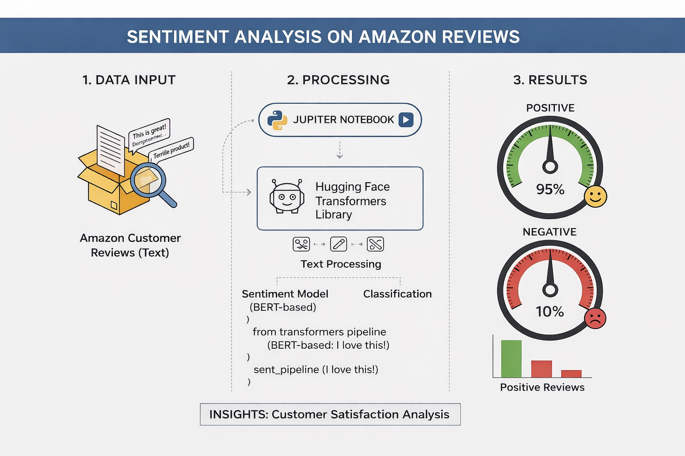

# Sentiment Analysis of Amazon Fine Food Reviews
<div align="center">
  
</div>


## 📌 Project Overview

This project performs sentiment analysis on Amazon Fine Food reviews using two different Natural Language Processing (NLP) approaches:

1. **Lexicon-based method (VADER)** - A rule-based sentiment analyzer
2. **Deep learning transformer model (RoBERTa)** - A state-of-the-art pretrained language model

The objective is to compare traditional sentiment analysis techniques with modern transformer-based models and highlight their strengths and limitations when applied to real-world customer reviews.

---

## 📂 Dataset

- **Name:** Amazon Fine Food Reviews
- **Source:** Public Amazon reviews dataset
- **Description:** The dataset contains customer reviews, ratings (1–5 stars), review text, and metadata
- **Task:** Predict the sentiment of each review (positive, neutral, or negative) based on the review text

---

## 🛠️ Project Workflow

### 1️⃣ Exploratory Data Analysis (EDA)
- Analysis of review score distribution
- Identification of class imbalance
- Basic text statistics (length, frequency)
- Visualization using **Matplotlib** and **Seaborn**

### 2️⃣ VADER Sentiment Analysis
- Uses **NLTK's VADER** (Valence Aware Dictionary and sEntiment Reasoner)
- Designed for social media and short texts
- Generates sentiment scores: `positive`, `neutral`, `negative`, and `compound` (overall sentiment)

### 3️⃣ Transformer-Based Sentiment Analysis (RoBERTa)
- Uses a **pretrained RoBERTa model** from Hugging Face
- Captures context, negation, and complex language patterns
- Steps:
  - Tokenization using `AutoTokenizer`
  - Inference using `AutoModelForSequenceClassification`
  - Softmax applied to model outputs to obtain sentiment probabilities

### 4️⃣ Model Comparison
- Comparison between **VADER compound scores** and **RoBERTa predictions**
- Identification of cases where VADER fails due to sarcasm or context
- Qualitative analysis using example reviews

---

## 🧰 Technologies & Libraries

- **Programming Language:** Python
- **Data Handling:** Pandas, NumPy
- **NLP:** NLTK, Transformers (Hugging Face)
- **Deep Learning:** PyTorch
- **Visualization:** Matplotlib, Seaborn
- **Math & Utilities:** SciPy

---

## ⚙️ Installation & Setup

### 1. Clone the Repository
```bash
git clone https://github.com/your-username/sentiment-analysis-amazon-reviews.git
cd sentiment-analysis-amazon-reviews
```

### 2. Install Dependencies
```bash
pip install pandas numpy matplotlib seaborn nltk transformers torch scipy
```

### 3. Download NLTK Resources
```python
import nltk
nltk.download('vader_lexicon')
nltk.download('punkt')
```

---

## ▶️ How to Run the Project

1. Launch Jupyter Notebook:
```bash
jupyter notebook sentiment_analysis_amazon_reviews.ipynb
```

2. Run all cells sequentially to reproduce the full analysis and results

---

## 📊 Results & Insights

### VADER
- Fast and lightweight
- Performs well on short, explicit sentiment reviews
- Struggles with sarcasm and complex context

### RoBERTa
- Superior performance on complex and contextual language
- Handles negation, sarcasm, and long reviews more effectively
- More computationally intensive

**Key Finding:** Transformer-based models outperform lexicon-based approaches in most real-world cases.

---

## 🚀 Future Improvements

- Fine-tune RoBERTa on the Amazon dataset for improved accuracy
- Add quantitative evaluation metrics (accuracy, F1-score, precision, recall)
- Perform error analysis with confusion matrices
- Deploy the model using Streamlit or Flask for interactive demos
- Experiment with other transformer models (BERT, DistilBERT, XLNet)

---

## 📁 Project Structure

```
sentiment-analysis-amazon-reviews/
├── sentiment_analysis_amazon_reviews.ipynb
├── README.md
├── data/
│   └── amazon_reviews.csv
└── requirements.txt
```

---

## 👤 Author

**Mustapha**  
NLP & Data Science Enthusiast

---

## 📄 License

This project is open source and available under the [MIT License](LICENSE).

---

## 🤝 Contributing

Contributions, issues, and feature requests are welcome! Feel free to check the [issues page](https://github.com/your-username/sentiment-analysis-amazon-reviews/issues).

---

## ⭐ Show Your Support

If you found this project helpful, please give it a star!
